# Mini Multimeter

> **STM32F103C8T6 measurement and PWM signal tool** — resistance/capacitance measurement, PWM frequency/duty capture, programmable PWM output, LCD1602 UI, Flash persistence, UART diagnostics, and a layered bare-metal firmware architecture.

[Architecture Notes](ARCHITECTURE.md) · [Local Demo Video](Demo/demo.mp4) · [License](LICENSE)

---

## Demo Video

https://github.com/user-attachments/assets/a0ac701d-f62f-4f02-b387-78f6bc3d9e51

---

## Table of Contents

- [1. Project Overview](#1-project-overview)
- [2. Key Features](#2-key-features)
- [3. Hardware and Pin Mapping](#3-hardware-and-pin-mapping)
- [4. Software Architecture](#4-software-architecture)
- [5. Runtime and Concurrency Model](#5-runtime-and-concurrency-model)
- [6. Measurement Principles and Algorithms](#6-measurement-principles-and-algorithms)
- [7. PWM Signal Generation](#7-pwm-signal-generation)
- [8. User Interface and State Machines](#8-user-interface-and-state-machines)
- [9. Configuration and Flash Persistence](#9-configuration-and-flash-persistence)
- [10. Diagnostics and Error Handling](#10-diagnostics-and-error-handling)
- [11. Validation Results](#11-validation-results)
- [12. Build, Flash, and Project Footprint](#12-build-flash-and-project-footprint)
- [13. Design Decisions and Trade-offs](#13-design-decisions-and-trade-offs)
- [14. Limitations and Future Improvements](#14-limitations-and-future-improvements)
- [15. Repository Structure](#15-repository-structure)
- [16. References](#16-references)
- [17. License](#17-license)

---

## 1. Project Overview

Mini Multimeter is a bare-metal embedded project built around the **STM32F103C8T6**. It combines two related functions in one firmware:

1. **Measurement**
   - Resistance.
   - Capacitance.
   - PWM frequency.
   - PWM duty cycle.
   - Single-measurement mode.
   - Sequential `All Mode`.

2. **Signal generation**
   - Programmable PWM frequency.
   - Programmable PWM duty cycle.
   - Adjustable frequency/duty step sizes.
   - Persistent settings stored in internal Flash.

The project deliberately does **not** use an RTOS. Runtime work is coordinated by a super-loop, explicit state machines, short interrupt handlers, and non-blocking peripheral workflows.

### 1.1 At a glance

| Item | Implementation |
|---|---|
| MCU | STM32F103C8T6 |
| CPU | Arm Cortex-M3 |
| System clock | 72 MHz |
| Firmware model | Bare-metal super-loop + interrupts |
| Peripheral library | STM32F1 Standard Peripheral Library |
| IDE / build | Keil µVision / Arm Compiler 6 project |
| Display | LCD1602 through PCF8574/PCF8574A I2C backpack |
| User input | 4 active-low push buttons |
| Analog measurement | ADC1, interrupt-driven 16-sample batches |
| PWM output | TIM2 CH2 on PA1 |
| PWM capture | TIM1 / TIM3 / TIM4 selected by expected frequency |
| Persistent storage | Final 1 KB internal Flash page, versioned record + CRC-32 |
| Diagnostics | USART1 + centralized Error Manager |

### 1.2 Engineering goals

The project is structured around several practical embedded-software goals:

- Keep the runtime model simple enough to understand without an RTOS.
- Separate application state, use-case logic, hardware drivers, diagnostics, and platform code.
- Keep time-critical ISR work minimal.
- Avoid blocking delays in normal application/UI workflows.
- Make measurement status explicit instead of inferring state from numeric values.
- Preserve hardware ownership when sequential modes share a peripheral.
- Protect saved configuration against invalid metadata, corrupted records, and failed Flash programming.
- Keep LCD updates controlled so the I2C/UI path does not dominate the main loop.

---

## 2. Key Features

### 2.1 Measurement

- Resistance measurement using an ADC voltage divider.
- Stateful open-socket detection for resistance.
- Multi-stage resistance stabilization:
  - 16-sample ADC averaging.
  - ADC low-pass filter.
  - Median-of-5 filter in the measurement service.
  - Adaptive EMA.
  - Output deadband.
  - 300 ms change confirmation.
  - 1 s LCD sample-and-hold.
- Capacitance measurement using an RC charge/discharge timing method.
- Dedicated capacitor measurement state machine.
- Empty/open capacitor detection during timed charging.
- PWM frequency measurement using timer input capture.
- PWM duty measurement from captured period/high-time pairs.
- Three capture timers for low, middle, and high expected-frequency ranges.
- `No Signal`, `No Resistor`, `No Capacitor`, and `Error` represented as explicit statuses.

### 2.2 Signal generation

- TIM2 CH2 PWM output on PA1.
- Configurable frequency from **1 Hz to 100 kHz**.
- Configurable duty cycle from **1% to 100%**.
- Adjustable frequency step from **1 Hz to 10 kHz**.
- Adjustable duty step from **1% to 10%**.
- Timer PSC/ARR/CCR calculation performed in the Service layer.

### 2.3 UI and reliability

- LCD1602 over I2C2 at 100 kHz.
- Automatic LCD backpack address scan for:
  - PCF8574: `0x20..0x27`.
  - PCF8574A: `0x38..0x3F`.
- Custom LCD characters for scroll arrows and the ohm symbol.
- 20 ms time-based button debounce.
- 8-entry button-event FIFO.
- CHARGE button enabled only while capacitor measurement owns it.
- Non-blocking 2 s startup splash.
- Non-blocking 800 ms save feedback.
- Per-menu cursor memory.
- LCD shadow buffer to avoid rewriting unchanged rows/cells.
- Flash configuration protected by magic, version, record size, value-range checks, CRC-32, and read-back verification.
- Centralized diagnostic history with repeated-error coalescing.

---

## 3. Hardware and Pin Mapping

### 3.1 Main hardware

- STM32F103C8T6 board.
- LCD1602 with PCF8574/PCF8574A I2C backpack.
- Four push buttons.
- Resistor voltage-divider network.
- Capacitor RC timing network.
- ST-Link programmer/debugger.
- Optional external PWM source or PA1 loopback for PWM measurement testing.
- UART-to-USB adapter if serial logs are required.

### 3.2 Firmware pin map

| Function | Peripheral | Pin | Direction / mode | Purpose |
|---|---|---:|---|---|
| Resistance input | ADC1 CH3 | PA3 | Analog input | Voltage-divider ADC node |
| Capacitance input | ADC1 CH4 | PA4 | Analog input | RC voltage observation |
| Capacitor control | GPIOA | PA5 | Push-pull output while active | Charge/discharge control |
| PWM output | TIM2 CH2 | PA1 | Alternate-function push-pull | Generated PWM |
| PWM input, high range | TIM1 CH1/CH2 PWM-input mode | PA8 | Pull-down input | High-frequency capture |
| PWM input, mid range | TIM3 CH1/CH2 PWM-input mode | PA6 | Pull-down input | Mid-frequency capture |
| PWM input, low range | TIM4 CH1/CH2 PWM-input mode | PB6 | Pull-down input | Low-frequency capture |
| LCD SCL | I2C2 | PB10 | AF open-drain | 100 kHz I2C clock |
| LCD SDA | I2C2 | PB11 | AF open-drain | 100 kHz I2C data |
| UP button | GPIOB | PB12 | Input pull-up | Menu navigation |
| DOWN button | GPIOB | PB13 | Input pull-up | Menu navigation |
| SELECT button | GPIOB | PB14 | Input pull-up | Enter / confirm / return |
| CHARGE button | GPIOB | PB15 | Input pull-up | Start capacitor sequence |
| UART1 TX | USART1 | PA9 | AF push-pull | Debug logs |
| UART1 RX | USART1 | PA10 | Floating input | UART receive |

### 3.3 Functional hardware view

The hardware view is split into two focused diagrams so the signal paths remain readable on GitHub without zooming.

**Measurement and signal path**

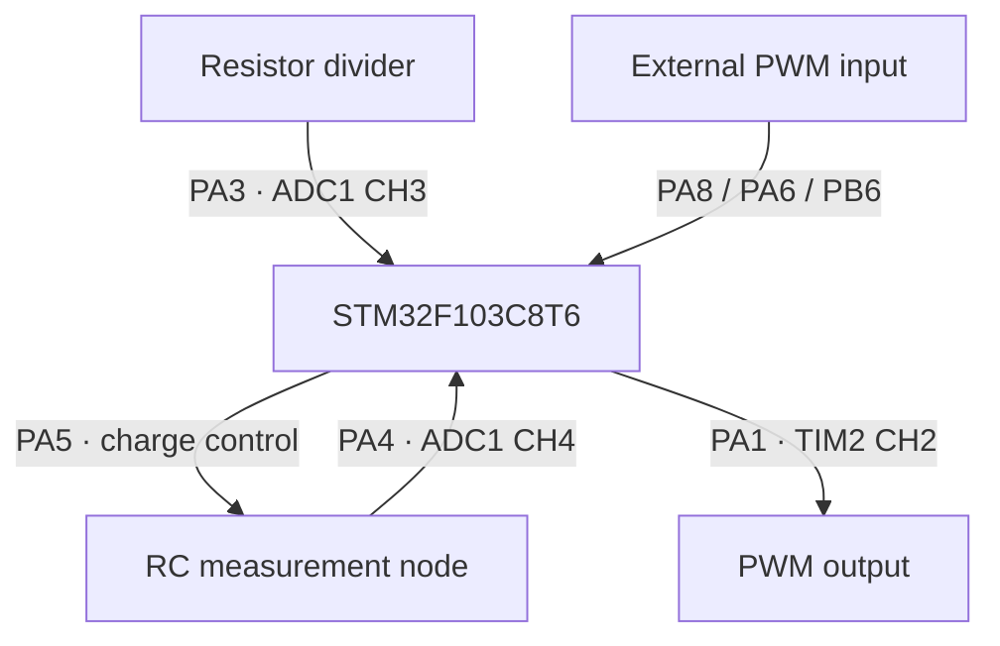

**User interface and diagnostics path**

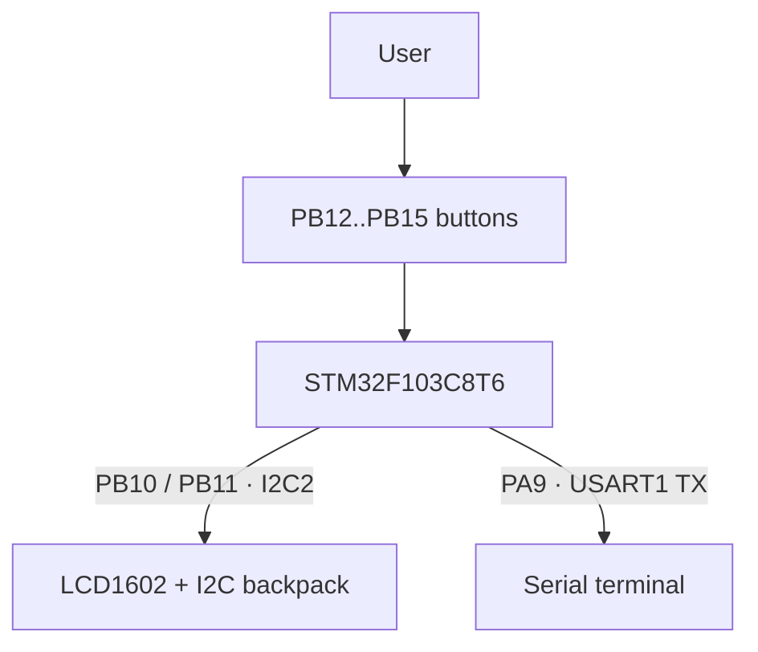

### 3.4 Clock assumptions used by the firmware

The Keil device startup configures the STM32F103 system for **72 MHz**. The project then derives peripheral timing from that clock tree:

```text
SYSCLK / HCLK       = 72 MHz
APB2                = 72 MHz
APB1                = 36 MHz
APB1 timer clock    = 72 MHz   (timer clock x2 when APB1 prescaler != 1)
ADC clock           = 12 MHz   (PCLK2 / 6)
I2C2                = 100 kHz  standard mode
SysTick             = 1 ms
```

These assumptions directly affect ADC timing, PWM generation, PWM capture, SysTick-based timeouts, and the capacitance calculation.

---

## 4. Software Architecture

The source is organized as a layered embedded architecture rather than a monolithic `main.c`.

### 4.1 Dependency direction

The architecture has a primary downward dependency axis, plus a small set of deliberate direct dependencies used by the current source.

**Primary dependency axis**

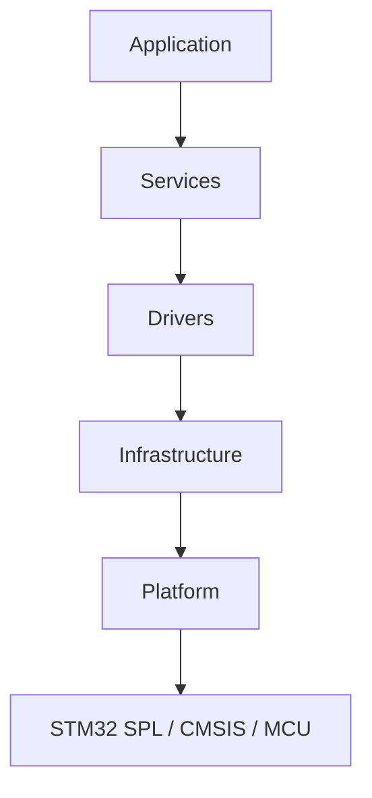

**Direct dependencies present in the implementation**

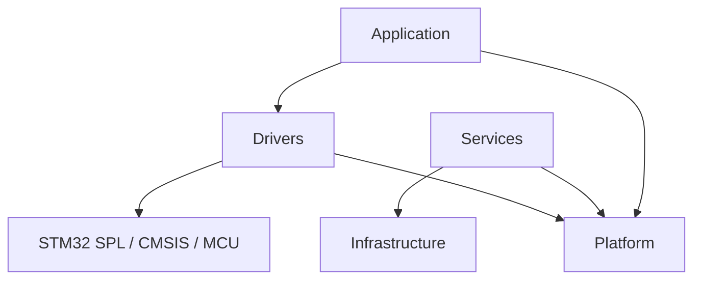

The architectural rule is not that every call must pass through every layer. The important rule is **dependency direction**: low-level modules must not depend on application/UI state.

### 4.2 Layer responsibilities

| Layer | Main files | Responsibility |
|---|---|---|
| Application | `main.c`, `app_controller`, `ui_controller`, `ui_view`, `ui_formatter` | Boot orchestration, menu FSM, button-event handling, UI state, LCD presentation |
| Services | `measurement_service`, `signal_generator_service`, `config_service` | Use-case logic and algorithms independent of LCD/menu details |
| Drivers | ADC, buttons, capacitor control, Flash, LCD, PWM input/output | Direct hardware/peripheral control |
| Infrastructure | `error_manager`, `debug_logger` | Cross-cutting diagnostics |
| Platform | `platform_init`, `system_time`, `uart_port` | MCU/system services shared by higher modules |
| Vendor | CMSIS + STM32F1 StdPeriph | Startup, core support, register/peripheral implementation |

### 4.3 UI responsibility split

The LCD/UI code is intentionally separated into three responsibilities:

```text
ButtonEvent_t
     |
     v
UiController
  - owns menu state
  - decides transitions
  - decides actions
     |
     v
UiView
  - owns LCD layout/rendering
  - maintains shadow buffer
     |
     v
UiFormatter
  - converts numeric values to display strings
  - no hardware dependency
```

This keeps the UI controller from directly formatting resistance/capacitance/frequency strings or manipulating the LCD driver.

### 4.4 Measurement service boundary

The application does not directly coordinate ADC/TIM measurement details. It selects a measurement mode and consumes a status/result interface:

```text
UiController
    |
    +--> MeasurementService_SetMode(...)
    +--> MeasurementService_Process()
    +--> MeasurementService_GetStatus()
    +--> MeasurementService_GetResult(...)
                  |
                  +--> ADC Driver
                  +--> Capacitor Charge Driver
                  +--> PWM Capture Driver
                  +--> PWM Output Driver
```

This matters because `0.0` is not overloaded to mean every possible state. The service can explicitly report:

```text
IDLE
MEASURING
READY
WAIT_CHARGE
DISCHARGING
CHARGING
NO_SIGNAL
NO_COMPONENT
ERROR
```

For more architectural detail, see [`ARCHITECTURE.md`](ARCHITECTURE.md).

---

## 5. Runtime and Concurrency Model

### 5.1 Boot sequence

`main.c` is intentionally minimal:

```c
int main(void) {
  AppController_Init();
  while (1) {
    AppController_RunOnce();
  }
}
```

Initialization order is controlled by `AppController_Init()`:

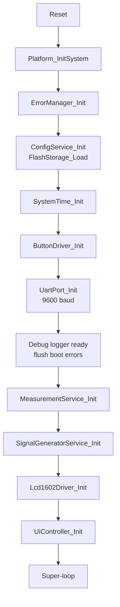

The Error Manager starts **before** Flash load and UART. This allows early Flash faults to be stored in RAM and emitted later when the logger becomes available.

### 5.2 Main-loop work

Every `AppController_RunOnce()` iteration performs three high-level jobs:

```text
1. ButtonDriver_Process()
   -> sample GPIO
   -> debounce
   -> enqueue press events

2. Drain button-event FIFO
   -> UiController_HandleEvent(event)

3. UiController_Update()
   -> advance current UI/measurement state
   -> render only when state/value requires it

4. Observe UART TX timeout counter
   -> report new timeout to Error Manager
```

### 5.3 Interrupt versus main context

The firmware uses interrupts only where asynchronous timing/data capture is useful.

The interrupt/main-context relationships are split into two narrow diagrams so GitHub does not compress four interrupt sources into one wide canvas.

**UI and system-time path**

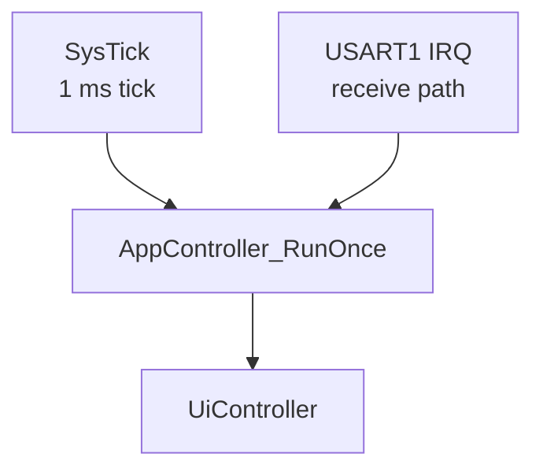

**Measurement path**

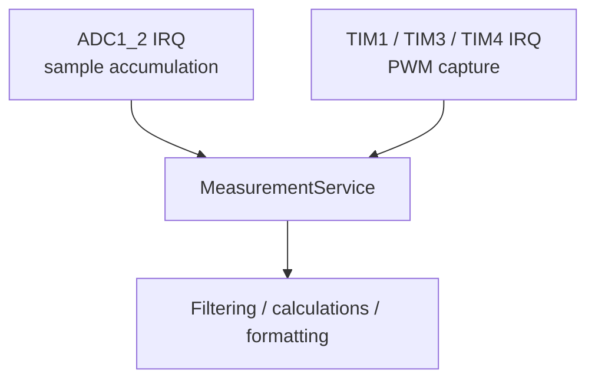

The ADC ISR intentionally avoids floating-point filtering and formatting. It only reads samples, accumulates an integer sum, and publishes a completed batch.

### 5.4 ADC batch sequence

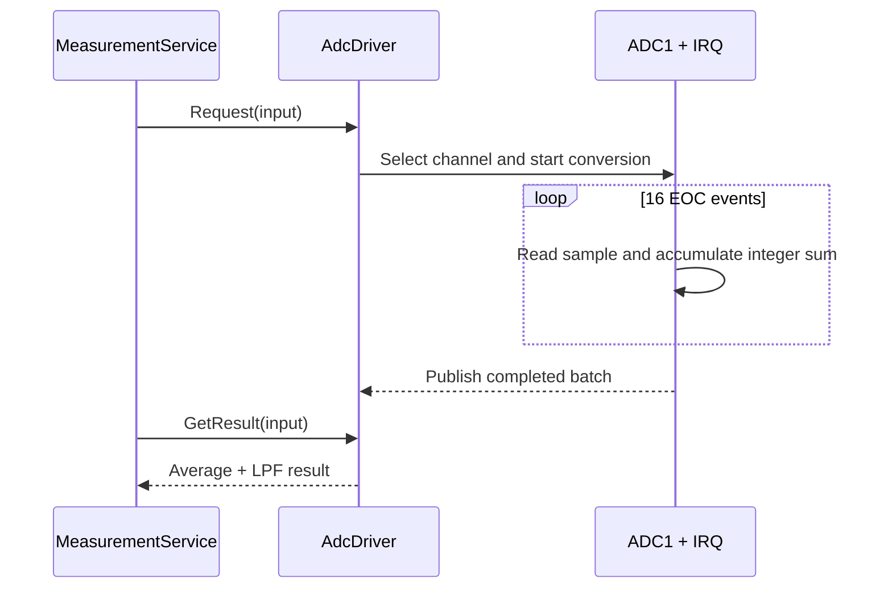

`MeasurementService` also runs a **100 ms ADC-result watchdog**. If an outstanding batch does not complete in time, the service cancels the ADC request, enters `ERROR`, and records `ADC_CONVERSION_TIMEOUT`.

### 5.5 Interrupt priority intent

PWM capture is the most time-sensitive interrupt path in this project:

| Interrupt | Configured priority | Reason |
|---|---:|---|
| TIM1/TIM3/TIM4 capture | Preemption priority `0`, subpriority `1` | Preserve PWM edge timing |
| ADC1_2 | Preemption priority `1`, subpriority `0` | ADC batch timing is less critical than PWM capture |
| SysTick | CMSIS default after `SysTick_Config()` | 1 ms software timebase |
| USART1 RX | Enabled through NVIC | Debug/receive path; not part of measurement timing |

---

## 6. Measurement Principles and Algorithms

The measurement layer is not a single formula. Each mode combines a hardware principle with state validation, filtering, timeout handling, and UI publication rules.

### 6.1 Resistance measurement

#### Circuit principle

```text
       3.3 V
         |
     Rref = 10 kΩ
         |
         +------> PA3 / ADC1_CH3
         |
        Rx
         |
        GND
```

For the divider:

```text
Vadc = Vcc * Rx / (Rref + Rx)
```

Therefore:

```text
Rx = Rref * Vadc / (Vcc - Vadc)
```

The firmware uses:

```text
Vcc             = 3.3 V
Rref            = 10 kΩ
ADC resolution  = 4096.0 counts in the normalization formula
```

So the implementation computes approximately:

```text
Vadc = filtered_adc / 4096.0 * 3.3
Rx   = 10000 * Vadc / (3.3 - Vadc)
```

#### ADC acquisition pipeline

The resistor path contains multiple filters, each solving a different problem:

```text
ADC1 CH3
   |
   v
16-sample integer average
   |
   v
ADC-driver LPF, alpha = 0.2
   |
   v
Median of last 5 ADC batches
   |
   v
Voltage-divider conversion
   |
   v
Adaptive EMA
   |
   v
Output deadband
   |
   v
300 ms sustained-change confirmation
   |
   v
1 s LCD sample-and-hold
```

The adaptive EMA uses two coefficients:

```text
relative change < 5%   -> alpha = 0.05
relative change >= 5%  -> alpha = 0.30
```

Small variations are strongly smoothed, while a real component change can converge faster.

The published resistance uses a deadband of:

```text
max(0.5% of current stable value, 1 Ω)
```

A value must remain outside that band in the same direction for **300 ms** before the stable value is replaced.

#### Resistor presence state

An open divider approaches ADC full scale. The service therefore uses asymmetric, stateful open/present qualification rather than a single threshold:

```text
open threshold      = 4075 counts
present threshold   = 4060 counts
open confirmation   = 3 batches
re-insertion count  = 5 batches
re-insertion time   = 200 ms continuous qualification
```

To avoid edge-label collisions, startup classification and steady-state hysteresis are shown separately.

**Startup qualification**

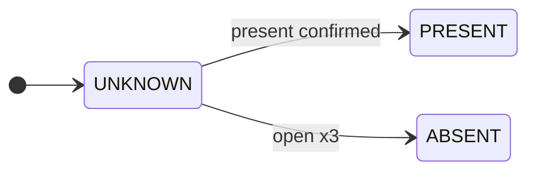

**Steady-state presence hysteresis**


`ABSENT` maps to the UI status `No Resistor`. The hysteresis gap between 4060 and 4075 prevents status chatter near full scale.

---

### 6.2 Capacitance measurement

#### RC network

```text
PA5 / CAP_CHARGE_CTRL
         |
   Rtiming = 20 kΩ
         |
         +------> PA4 / ADC1_CH4
         |
        Cx
         |
        GND
```

The firmware observes the capacitor node through ADC1 CH4 and controls charging through PA5.

For an ideal charging capacitor:

```text
V(t) = Vcc - (Vcc - Vstart) * exp(-t / RC)
```

The implementation does not measure a full `0 -> 63.2%` interval. It times the transition between two ADC thresholds:

```text
low threshold   = 1241 counts  ≈ 1.0 V
high threshold  = 2482 counts  ≈ 2.0 V
Rtiming         = 20 kΩ
```

The calibrated firmware equation is:

```text
C = 1.74563473 * t / 20000
```

where `t` is measured in seconds using the 1 ms SysTick timebase.

#### Capacitor state machine

The normal measurement cycle and the early no-component path are shown separately. This avoids placing two long transitions around `TIMED_CHARGE` in the same Mermaid canvas.

**Normal measurement cycle**

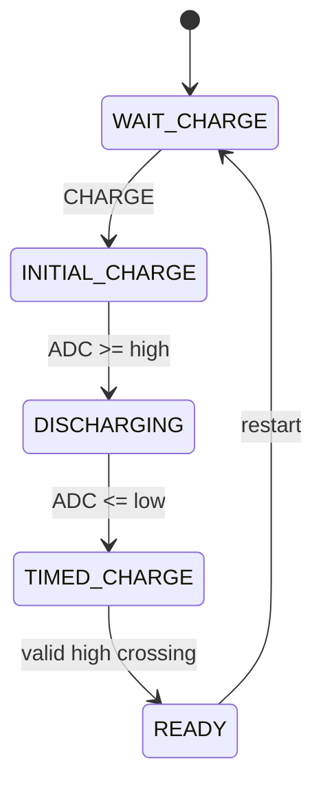

**Early no-component detection**

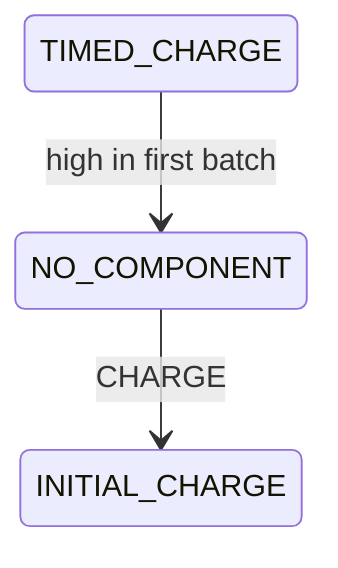

Implementation sequence:

1. Enter capacitor mode.
2. Enable PA5 as a push-pull control output.
3. UI shows `Press Charge`.
4. CHARGE press starts initial charging.
5. Once the high threshold is crossed, PA5 is driven low and discharge begins.
6. Once the low threshold is crossed:
   - PA5 is driven high.
   - start tick is recorded.
   - the capacitor ADC filter is reset.
7. When the high threshold is crossed again, elapsed time is converted to capacitance.
8. PA5 is driven low and the result becomes `READY`.

If the timed-charge stage crosses the high threshold in its **first completed ADC batch**, the service reports `NO_COMPONENT`. For this project that represents an empty/open socket or a capacitance below the intended lower range.

---

### 6.3 PWM frequency and duty measurement

The input driver uses STM32 timer **PWM Input mode**:

- CH1 captures the PWM period on rising edges.
- CH2 captures high time from the corresponding falling edge.
- The timer runs in reset slave mode triggered by TI1FP1.

```text
HIGH      +---------+              +---------+
          |         |              |         |
LOW  -----+         +--------------+         +------
          ^         ^              ^
          |<-Thigh->|              |
          |<---------- T --------->|
```

The service calculates:

```text
frequency = timer_clock_hz / period_ticks

duty (%)  = high_ticks / period_ticks * 100
```

A sample is accepted only when:

```text
period_ticks > 0
high_ticks <= period_ticks
```

If no fresh capture is observed for more than **1100 ms**, status becomes `NO_SIGNAL`.

#### Timer range selection

Only one capture timer is active at a time.

| Expected frequency | Timer | Pin | PSC | Effective counter clock |
|---:|---|---:|---:|---:|
| `< 200 Hz` | TIM4 | PB6 | 1098 | `72 MHz / 1099` |
| `200 Hz .. < 4 kHz` | TIM3 | PA6 | 7 | `9 MHz` |
| `>= 4 kHz` | TIM1 | PA8 | 0 | `72 MHz` |

Before enabling a range, the driver:

```text
Disable TIM1/TIM3/TIM4
-> mark no active channel
-> reset counters
-> clear pending CC/update flags
-> clear stale ready flags
-> prepare selected timer state
-> enable exactly one timer
```

The selected timer is based on the **expected frequency** supplied by the application, currently the configured signal-generator frequency. This is an explicit design trade-off discussed later in the README.

---

### 6.4 Sequential `All Mode`

`All Mode` advances through four measurement screens using SELECT:

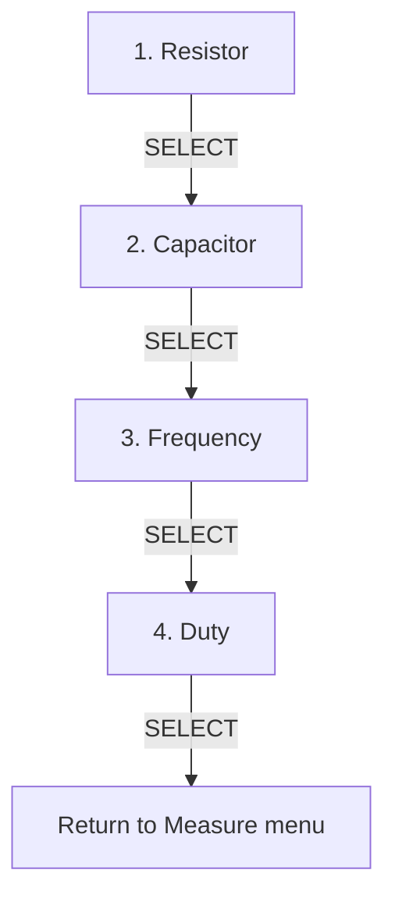

Resource transitions are intentionally optimized:

```text
Resistor -> Capacitor
    keep ADC enabled
    cancel only the old ADC batch

Frequency -> Duty
    keep the same MEASUREMENT_MODE_FREQUENCY_DUTY
    keep PWM capture/output resources active
```

This prevents unnecessary peripheral teardown/reinitialization during a sequential measurement workflow.

---

## 7. PWM Signal Generation

PWM output is produced by **TIM2 Channel 2 on PA1**.

```text
Timer clock = 72 MHz
Frequency   = 1 Hz .. 100 kHz
Duty        = 1% .. 100%
```

### 7.1 Timer equations

For TIM2:

```text
fPWM = 72 MHz / ((PSC + 1) * (ARR + 1))
```

PWM Mode 1 is used:

```text
CNT < CCR2   -> output HIGH
CNT >= CCR2  -> output LOW
```

The compare value is derived from duty:

```text
CCR2 ≈ (ARR + 1) * duty / 100
```

The driver clamps the compare value so it does not exceed ARR.

### 7.2 Configuration search used by the service

`SignalGeneratorService` scans candidate prescalers from low to high.

For each PSC:

```text
ticks_candidate = round(timer_clock / ((PSC + 1) * target_frequency))
```

The candidate is accepted only if its tick count fits the 16-bit timer range.

Then:

```text
actual_frequency = timer_clock / ((PSC + 1) * ticks_candidate)
error            = abs(actual_frequency - target_frequency)
```

The implementation tracks the best candidate seen so far and stops when it reaches a configuration satisfying:

```text
error * 100 < target_frequency
```

which corresponds to an error below **1%** of the requested frequency.

The Service layer performs this calculation; `pwm_output_driver.c` only applies the final `PSC`, `ARR`, and `CCR2` values to TIM2.

---

## 8. User Interface and State Machines

### 8.1 Buttons

| Button | Runtime meaning |
|---|---|
| UP | Navigate upward or increase an editable value |
| DOWN | Navigate downward or decrease an editable value |
| SELECT | Enter, confirm/save, advance `All Mode`, or leave measurement |
| CHARGE | Start capacitor measurement only while capacitor mode is active |

Buttons are active-low with internal pull-ups. A press is emitted only after the input remains at the new raw level for **20 ms**.

The event path is:

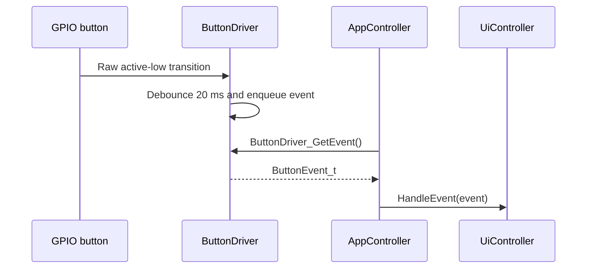

### 8.2 Menu hierarchy

```text
MAIN
├── Measure
│   ├── Single Mode
│   │   ├── Resistor
│   │   ├── Capacitor
│   │   ├── Frequency
│   │   ├── Duty Cycle
│   │   └── Back
│   │
│   ├── All Mode
│   │   ├── Resistor
│   │   ├── Capacitor
│   │   ├── Frequency
│   │   └── Duty Cycle
│   │
│   └── Back
│
└── Transmit
    ├── Frequency
    ├── Duty Cycle
    ├── Setting
    │   ├── Frequency Step
    │   └── Duty Step
    └── Back
```

### 8.3 UI state machine

The complete UI is split into focused state diagrams. This keeps each diagram readable at normal GitHub zoom while preserving the same state transitions.

**Top-level navigation**

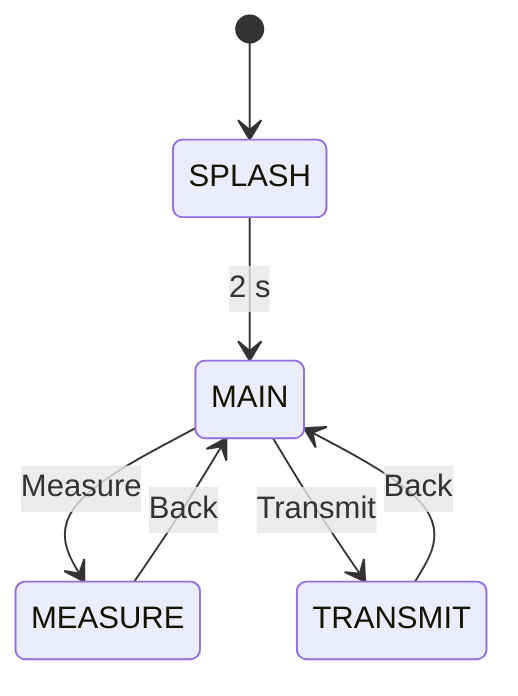

**Measure-mode navigation**

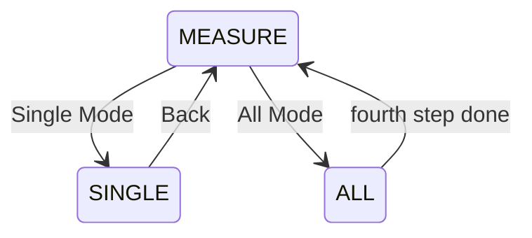

**Single-measurement branch**

```text
SINGLE
├── Resistor   -> RESISTOR
├── Capacitor  -> CAPACITOR
├── Frequency  -> FREQUENCY
└── Duty Cycle -> DUTY

SELECT in RESISTOR / CAPACITOR / FREQUENCY / DUTY
    -> Handle_Measure_Exit()
    -> SINGLE
```

This is the exact behavior implemented by `Handle_Measure_Single_Menu()` and `Handle_Measure_Exit()`.

**Transmit and settings branch**

The transmit editor and settings workflow also share `SAVE_FEEDBACK`, so one large state diagram creates unnecessary crossing edges. The implementation is easier to read as three focused paths.

**Frequency editor**

```text
TRANSMIT
  -> Frequency
  -> FREQ_EDIT
  -> SELECT / ConfigService_Save()
  -> SAVE_FEEDBACK (800 ms)
       ├── save OK   -> TRANSMIT
       └── save fail -> FREQ_EDIT
```

**Duty-cycle editor**

```text
TRANSMIT
  -> Duty Cycle
  -> DUTY_EDIT
  -> SELECT / ConfigService_Save()
  -> SAVE_FEEDBACK (800 ms)
       ├── save OK   -> TRANSMIT
       └── save fail -> DUTY_EDIT
```

**Step-setting sequence**

```text
TRANSMIT
  -> Setting
  -> FREQ_STEP
  -> SELECT / save
  -> SAVE_FEEDBACK (800 ms)
       ├── save OK   -> DUTY_STEP
       └── save fail -> FREQ_STEP

DUTY_STEP
  -> SELECT / save
  -> SAVE_FEEDBACK (800 ms)
       ├── save OK   -> TRANSMIT
       └── save fail -> DUTY_STEP
```

`SAVE_FEEDBACK` is one real UI state. `saveFeedbackReturnMenu` stores the state that should be entered after its 800 ms display interval, which is why the failure paths above return to the editor that initiated the save.

### 8.4 Non-blocking transient states

Two visible delays are modeled as UI states instead of application-level blocking delays:

```text
Splash        = 2000 ms
Save feedback = 800 ms
```

During these states button events are ignored, but the super-loop continues running.

The LCD driver itself still uses short blocking delays where required by LCD initialization/clear timing. The important distinction is that normal application navigation does not call a delay to hold a screen on display.

### 8.5 Per-menu cursor memory

Each list-style menu has its own cursor slot:

```text
Main
Measure
Single Mode
Transmit
```

Child states therefore do not overwrite the parent selection. `Back` is treated as a navigation command rather than a useful resume position; returning to the menu restores its last non-Back item.

### 8.6 LCD rendering strategy

`ui_view.c` maintains a two-row shadow buffer of exactly 16 characters per row.

The view layer:

- Avoids rewriting a row when the new 16-character image is unchanged.
- Writes exactly 16 cells when a row changes so stale characters cannot remain.
- Can update individual cells for scroll indicators.
- Keeps display-specific logic out of `ui_controller.c`.

Measurement redraw policy is also mode-specific:

| Mode | Display policy |
|---|---|
| Resistance | 1 s READY qualification + 1 s sample-and-hold |
| Frequency | At least 300 ms between accepted redraws; relative/absolute change threshold |
| Duty | At least 300 ms between accepted redraws; 0.1% absolute change threshold |
| Capacitor | Redraw on status/result transitions |

---

## 9. Configuration and Flash Persistence

Persistent settings are owned by `ConfigService`:

| Setting | Valid range | Default |
|---|---:|---:|
| PWM frequency | 1 .. 100000 Hz | 50000 Hz |
| PWM duty | 1 .. 100% | 50% |
| Frequency step | 1 .. 10000 Hz | 1000 Hz |
| Duty step | 1 .. 10% | 1% |

### 9.1 Reserved Flash region

The Keil linker/scatter configuration limits the application load region to:

```text
Application IROM:
0x08000000 .. 0x0800FBFF
size = 0xFC00 bytes
```

The final 1 KB page is reserved for configuration:

```text
Configuration page:
0x0800FC00 .. 0x0800FFFF
```

This prevents normal application growth from overlapping the persistent record.

### 9.2 V1 record layout

The private on-Flash record is 24 bytes:

```text
+----------------------+---------------------------+
| Field                | Purpose                   |
+----------------------+---------------------------+
| magic        u32     | 0xA5A5A5A5                |
| version      u16     | current format = 1        |
| record_size  u16     | sizeof(Config_t)          |
| frequency    u32     | PWM frequency             |
| duty         u16     | PWM duty                  |
| freq_step    u16     | frequency editor step     |
| duty_step    u8      | duty editor step          |
| reserved[3]          | deterministic padding     |
| crc32        u32     | IEEE CRC-32               |
+----------------------+---------------------------+
```

CRC uses polynomial `0xEDB88320` and covers all bytes before the `crc32` field.

### 9.3 Load state

The normal V1 validation path and the legacy fallback are shown separately to keep both branches legible.

**Current V1 record validation**

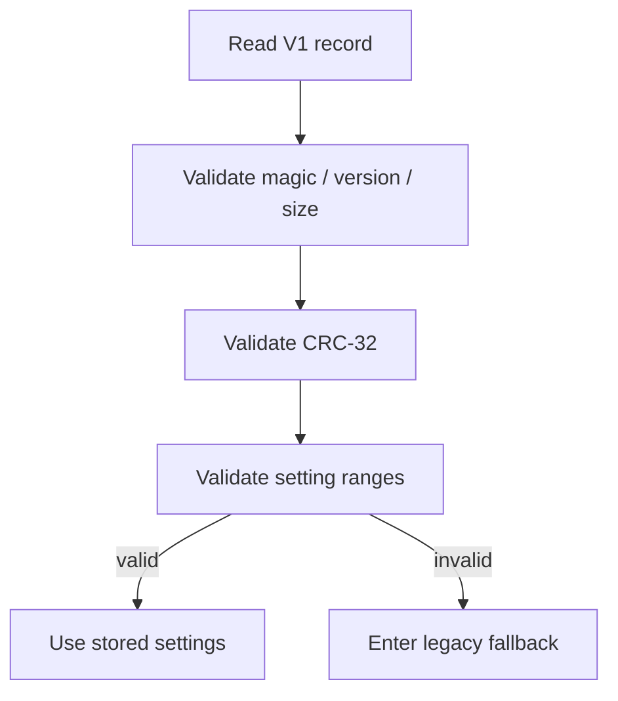

**Legacy fallback**

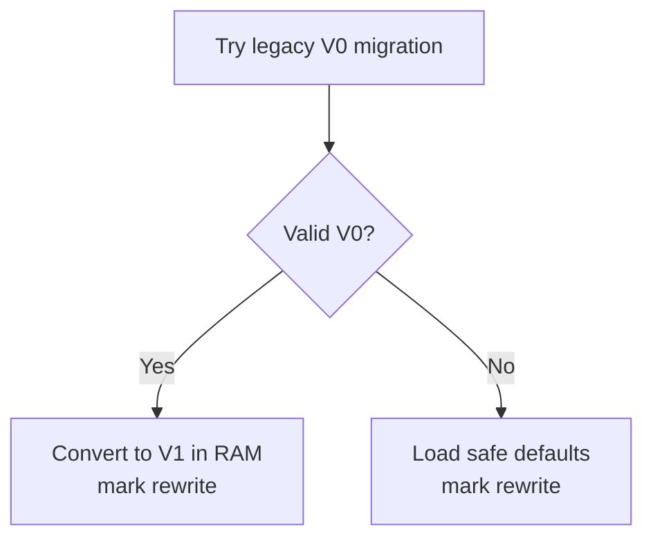

A migrated/default record is not immediately forced to Flash during boot; it is marked so the next save can rewrite the current format.

### 9.4 Save transaction

The save path is split at the durability boundary so the control decision and Flash critical section remain easy to read.

**Prepare and decide whether a write is needed**

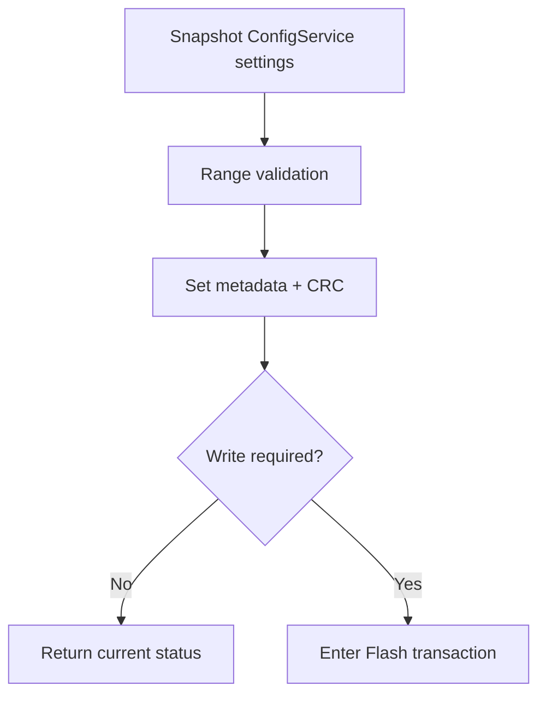

**Flash transaction and verification**

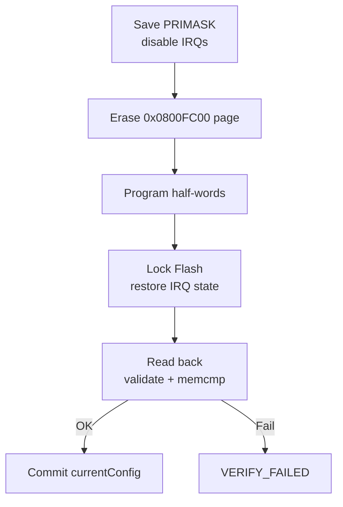

The driver reports separate statuses for:

```text
BAD_MAGIC
BAD_VERSION
BAD_SIZE
BAD_CRC
BAD_RANGE
ERASE_FAILED
PROGRAM_FAILED
VERIFY_FAILED
MIGRATED_V0
```

---

## 10. Diagnostics and Error Handling

### 10.1 UART debug channel

USART1 is configured as:

```text
TX      = PA9
RX      = PA10
Baud    = 9600
Format  = 8-N-1
```

The default compile-time log level is `INFO`:

```text
ERROR
WARN
INFO
TRACE
```

Log format:

```text
[timestamp_ms][level][module] message
```

Example:

```text
[0000000000][INFO][APP] Boot
[0000000000][WARN][FLASH] 0x0105 BAD_CRC
[0000000000][INFO][APP] Config F=50000Hz D=50% Fstep=1000 Dstep=1 (BAD_CRC)
[0000000001][INFO][LCD] Scanning I2C2 addresses
[0000000015][INFO][LCD] Found at 0x27
[0000000280][INFO][LCD] Init OK
```

### 10.2 Error Manager model

The Error Manager keeps an 8-entry in-RAM history:

```text
Error_Record_t
├── source
├── code
├── severity
├── timestamp_ms
└── repeat_count
```

Identical adjacent errors occurring within **1000 ms** are coalesced instead of consuming a new history slot or flooding UART.

To keep the decision labels away from GitHub's Mermaid toolbar, coalescing and log delivery are shown as two separate flows.

**Error coalescing**

```mermaid
flowchart TB
    MODULE["Driver / service"] --> REPORT["ErrorManager_Report"]
    REPORT --> SAME{"Same error within 1 s?"}
    SAME -->|"Yes"| COUNT["Increment repeat_count"]
    COUNT --> RETURN["Return"]
    SAME -->|"No"| STORE["Store new history record"]
```

**Delivery after a new record is stored**

```mermaid
flowchart TB
    STORE["New history record"] --> READY{"Logger ready?"}
    READY -->|"Yes"| LOG["Write UART log"]
    READY -->|"No"| LATER["Retain for ErrorManager_Flush"]
```

Monitored faults include:

- Flash metadata/integrity/range/programming failures.
- LCD I2C bus busy, start/address/data timeout, NACK, bus errors, or device not found.
- UART TX timeout.
- Button event FIFO overflow.
- ADC conversion timeout.
- PWM capture unavailable or invalid capture pair.

`NO_COMPONENT` and `NO_SIGNAL` are normal measurement states, not automatically treated as fatal errors.

### 10.3 LCD bus fault handling

The LCD driver uses a **10 ms I2C operation timeout**. During startup it scans only likely PCF8574 address ranges instead of the whole 7-bit address space.

A NACK during address scan is expected. A NACK after the LCD has already reached the ready state is treated as a runtime fault and reported.

---

## 11. Validation Results

The following tables are the measurement results documented for this project. They represent the project validation data, not a calibrated metrology specification.

### 11.1 Frequency measurement

| Test input | Measured result | Documented error |
|---:|---:|---:|
| 100 Hz | 99 – 101 Hz | < 1% |
| 500 Hz | 496 – 504 Hz | < 1% |
| 1 kHz | 0.99 – 1.01 kHz | < 1% |
| 5 kHz | 4.95 – 5.05 kHz | < 1% |
| 10 kHz | 9.9 – 10.1 kHz | < 1% |
| 20 kHz | 19.8 – 20.2 kHz | < 1% |
| 50 kHz | 49.5 – 50.5 kHz | < 1% |
| 100 kHz | 99 – 101 kHz | < 1% |

### 11.2 Duty-cycle measurement

| Test input | Measured result | Documented error |
|---:|---:|---:|
| 10% | 9.9 – 10.1% | < 1% |
| 20% | 19.8 – 20.2% | < 1% |
| 30% | 29.7 – 30.3% | < 1% |
| 40% | 39.6 – 40.4% | < 1% |
| 50% | 49.5 – 50.5% | < 1% |
| 60% | 59.4 – 60.6% | < 1% |
| 70% | 69.3 – 70.7% | < 1% |
| 80% | 79.2 – 80.8% | < 1% |
| 90% | 89.1 – 90.9% | < 1% |

### 11.3 Capacitance measurement

| Test component | Measured result | Documented error |
|---:|---:|---:|
| 100 nF | 90 – 115 nF | ~15% |
| 220 nF | 200 – 250 nF | ~14% |
| 470 nF | 430 – 520 nF | ~11% |
| 1 µF | 0.9 – 1.1 µF | ~10% |
| 2.2 µF | 2.0 – 2.45 µF | ~11% |
| 4.7 µF | 4.3 – 5.2 µF | ~11% |
| 10 µF | 9.5 – 10.8 µF | ~8% |
| 22 µF | 20 – 25 µF | ~13% |
| 47 µF | 43 – 52 µF | ~11% |
| 100 µF | 95 – 110 µF | ~10% |
| 220 µF | 205 – 245 µF | ~11% |
| 470 µF | 440 – 520 µF | ~11% |
| 1000 µF | 930 – 1120 µF | ~12% |

### 11.4 Resistance measurement

| Test component | Measured result | Documented error |
|---:|---:|---:|
| 100 Ω | 96 – 104 Ω | ~4% |
| 220 Ω | 213 – 228 Ω | ~3% |
| 330 Ω | 320 – 342 Ω | ~3% |
| 470 Ω | 455 – 488 Ω | ~4% |
| 1 kΩ | 0.98 – 1.02 kΩ | ~2% |
| 2.2 kΩ | 2.15 – 2.25 kΩ | ~2% |
| 4.7 kΩ | 4.58 – 4.82 kΩ | ~3% |
| 10 kΩ | 9.8 – 10.3 kΩ | ~3% |
| 22 kΩ | 21.3 – 22.8 kΩ | ~4% |
| 47 kΩ | 45.5 – 49.0 kΩ | ~4% |
| 100 kΩ | 96 – 105 kΩ | ~5% |
| 220 kΩ | 210 – 235 kΩ | ~7% |
| 470 kΩ | 445 – 510 kΩ | ~8% |
| 1 MΩ | 0.92 – 1.10 MΩ | ~10% |

---

## 12. Build, Flash, and Project Footprint

### 12.1 Toolchain represented by the checked-in build

The repository contains a Keil µVision project at:

```text
MDK/mini-multimeter.uvprojx
```

The current checked-in build log records:

```text
ARM.CMSIS pack             6.3.0
CMSIS Core component       6.2.0
Keil STM32F1xx DFP         2.4.1
STM32F1 StdPeriph drivers  3.6.0
Compiler project mode      Arm Compiler 6
Target device              STM32F103C8
```

### 12.2 Build

1. Open `MDK/mini-multimeter.uvprojx` in Keil µVision.
2. Verify the target device is `STM32F103C8`.
3. Verify the project include path contains:

```text
..\Application
..\Services
..\Drivers
..\Infrastructure
..\Platform
```

4. Build or **Rebuild all target files**.
5. Check that the linker still reserves the final 1 KB Flash page for configuration.

### 12.3 Flash and run

1. Connect ST-Link to the STM32 board.
2. Build the firmware.
3. Program the target from µVision.
4. Reset the MCU.
5. Verify:
   - LCD backpack is discovered.
   - The 2-second splash appears.
   - Main menu follows.
   - UART boot log appears if a serial terminal is connected at 9600 8-N-1.

### 12.4 Current build footprint

The checked-in build log reports:

```text
Code     = 28882 bytes
RO-data  = 1454 bytes
RW-data  = 164 bytes
ZI-data  = 2204 bytes

Total RO size             = 30336 bytes
Total RW size             = 2368 bytes
Total ROM size            = 30500 bytes
Build result              = 0 errors, 0 warnings
```

The application link region is `0xFC00` bytes rather than the full 64 KB because the last 1 KB is reserved for persistent settings.

---

## 13. Design Decisions and Trade-offs

This section captures choices that are especially relevant when reviewing the project as embedded firmware rather than only as a feature demo.

### 13.1 Super-loop instead of RTOS

The application has a small number of concurrent concerns, so a super-loop keeps scheduling visible and deterministic:

```text
GPIO/event handling
+ measurement state progression
+ LCD state rendering
+ timeout checks
```

Interrupts handle only asynchronous timing/data capture. This avoids adding RTOS task stacks, synchronization primitives, and scheduler behavior that are not required by the current feature set.

### 13.2 Minimal ISR policy

The ADC ISR performs integer accumulation only. PWM ISRs copy timer capture registers and timestamps. More expensive work is deferred to main context.

Benefits:

- Shorter interrupt occupancy.
- Less jitter for competing interrupts.
- No floating-point formatting in ISR context.
- Easier reasoning about shared state.

### 13.3 Explicit measurement status

The UI does not infer state from a measurement value. `0 Ω`, `0 Hz`, no input signal, no component, and an actual hardware error are semantically different conditions.

The status enum makes those distinctions explicit and avoids using magic numeric results as control flow.

### 13.4 Hardware ownership during mode transitions

`MeasurementService_SetMode()` owns peripheral lifecycle. UI states request a mode; they do not individually toggle every ADC/TIM resource.

This centralizes transitions such as:

```text
RESISTOR -> CAPACITOR
    cancel batch, preserve ADC enable

FREQUENCY_DUTY -> NONE
    disable PWM output and capture
```

### 13.5 Filtering belongs near measurement policy

Generic ADC averaging/LPF stays in `adc_driver.c`, but resistance-specific median/EMA/deadband logic lives in `measurement_service.c`.

That separation is intentional: the ADC driver should not know that one particular analog channel represents a resistor requiring a visually sticky result.

### 13.6 LCD shadowing and redraw throttling

LCD1602 over a PCF8574 backpack is much slower than internal MCU state changes. Rewriting a screen every main-loop iteration would waste I2C bandwidth and cause visible instability.

The project therefore combines:

- row shadowing;
- exact 16-cell row writes;
- change thresholds;
- mode-specific redraw periods.

### 13.7 Expected-frequency based capture range

PWM capture range is selected from the expected frequency rather than detected automatically. This keeps timer ownership simple and gives each frequency range suitable counter resolution, but it means an unrelated external signal can be measured with the wrong timer if the expected/configured value does not match it.

### 13.8 Flash integrity versus power-fail atomicity

The saved record has strong **detection** mechanisms:

```text
magic + version + size + range + CRC + read-back verify
```

However, the design uses a **single Flash page**. If power is lost after erase and before a complete verified write, the next boot will reject the record and fall back to defaults/legacy handling. It is not a redundant A/B journaled configuration store.

---

## 14. Limitations and Future Improvements

### 14.1 Current limitations

- Resistance accuracy depends on Vcc/Vref accuracy, reference-resistor tolerance, contact resistance, and ADC noise.
- The resistor network has no hardware auto-ranging.
- Very large resistances become electrically close to an open socket and can intentionally be classified as `No Resistor`.
- Capacitance accuracy depends on the 20 kΩ timing resistor, ADC thresholds, GPIO behavior, and the 1 ms SysTick timing resolution.
- Very small capacitors may cross the timing window too quickly and be classified as `No Capacitor`.
- PWM capture range is chosen from an expected frequency, not automatically discovered from an arbitrary external input.
- PWM output search is designed to find an acceptable `<1%` frequency solution, not exhaustively optimize every possible PSC/ARR pair.
- LCD1602 is limited to two 16-character rows.
- Configuration uses one Flash page; corruption is detected but there is no redundant power-fail-safe copy.
- UART RX collects input until `!`, but no application command protocol is currently built on top of that buffer.
- The project is intended for learning and embedded development, not calibrated laboratory measurement.

### 14.2 Good next improvements

- Hardware resistance auto-ranging.
- Multiple capacitor timing resistors / auto-ranging.
- Calibrated Vref or measured supply compensation.
- Per-range calibration coefficients stored in Flash.
- Automatic PWM input range discovery.
- DMA-based ADC acquisition for experiments with higher sample throughput.
- Dual-slot or journaled Flash configuration for stronger power-fail recovery.
- Structured UART command/telemetry protocol.
- Host-side logging and plotting utility.
- Automated hardware-in-the-loop tests for PWM loopback, buttons, LCD, ADC thresholds, and Flash recovery.
- Dedicated schematic/PCB documentation tied directly to the pin map in this README.

---

## 15. Repository Structure

```text
mini-multimeter/
├── Application/
│   ├── main.c
│   ├── app_controller.c/.h
│   ├── ui_controller.c/.h
│   ├── ui_view.c/.h
│   └── ui_formatter.c/.h
│
├── Services/
│   ├── config_service.c/.h
│   ├── measurement_service.c/.h
│   └── signal_generator_service.c/.h
│
├── Drivers/
│   ├── adc_driver.c/.h
│   ├── button_driver.c/.h
│   ├── capacitor_charge_driver.c/.h
│   ├── flash_storage_driver.c/.h
│   ├── lcd1602_driver.c/.h
│   ├── pwm_capture_driver.c/.h
│   └── pwm_output_driver.c/.h
│
├── Infrastructure/
│   ├── debug_logger.c/.h
│   └── error_manager.c/.h
│
├── Platform/
│   ├── platform_init.c/.h
│   ├── system_time.c/.h
│   └── uart_port.c/.h
│
├── Demo/
│   └── demo.mp4
│
├── MDK/
│   ├── mini-multimeter.uvprojx
│   ├── RTE/
│   ├── Objects/
│   └── Listings/
│
├── ARCHITECTURE.md
├── LICENSE
└── README.md
```

### Important entry points

| File | Why it matters |
|---|---|
| `Application/main.c` | Minimal firmware entry point |
| `Application/app_controller.c` | Initialization order and super-loop orchestration |
| `Application/ui_controller.c` | Main menu/UI FSM and per-state resource requests |
| `Services/measurement_service.c` | Core R/C/frequency/duty algorithms and measurement statuses |
| `Services/signal_generator_service.c` | PWM PSC/ARR/CCR calculation |
| `Drivers/adc_driver.c` | Interrupt-driven ADC batching |
| `Drivers/pwm_capture_driver.c` | Multi-timer PWM input capture |
| `Drivers/flash_storage_driver.c` | Versioned/CRC Flash persistence |
| `Infrastructure/error_manager.c` | Error history/coalescing |
| `ARCHITECTURE.md` | Additional architecture notes and old-to-new module mapping |

---

## 16. References

The firmware behavior and peripheral configuration are best understood together with the original vendor documentation:

- [STMicroelectronics — STM32F103 documentation](https://www.st.com/en/microcontrollers-microprocessors/stm32f103/documentation.html)
- [STMicroelectronics — RM0008: STM32F101xx/102xx/103xx/105xx/107xx Reference Manual](https://www.st.com/resource/en/reference_manual/cd00171190-stm32f101xx-stm32f102xx-stm32f103xx-advanced-arm-based-32-bit-mcus-stmicroelectronics.pdf)
- [STMicroelectronics — STM32F1 Series Documentation](https://www.st.com/en/microcontrollers-microprocessors/stm32f1-series/documentation.html)
- [Arm — CMSIS documentation](https://arm-software.github.io/CMSIS_6/latest/General/index.html)
- [Keil — µVision documentation](https://www.keil.com/support/man/docs/uv4/)

The checked-in Keil project additionally records the exact CMSIS/STM32F1 pack versions used by the current build in `MDK/Objects/mini-multimeter.build_log.htm`.

---

## 17. License

This project is released under the [MIT License](LICENSE).
