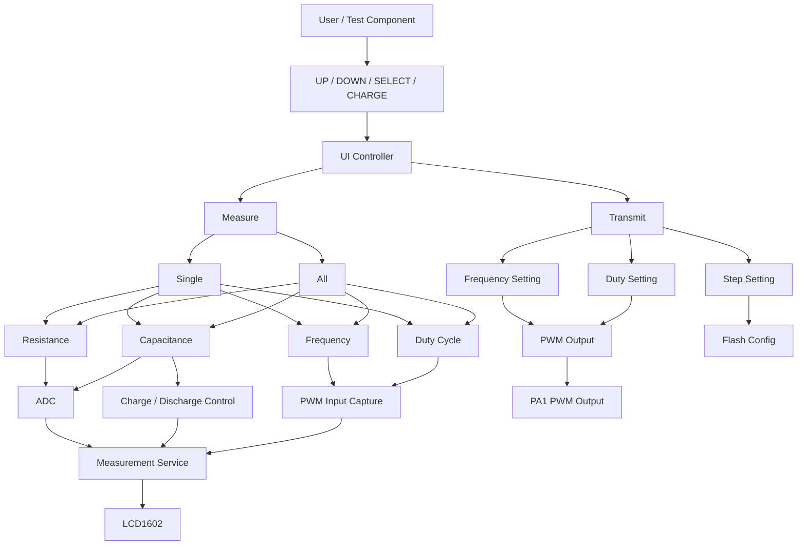
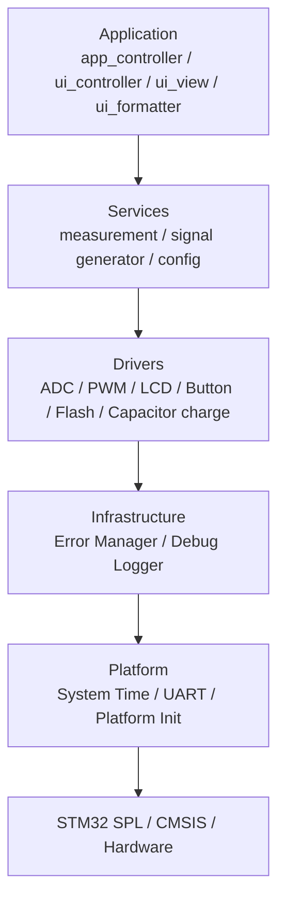
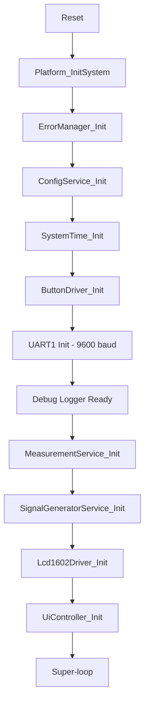
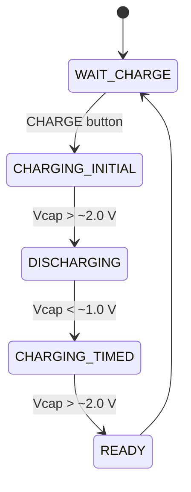

# Mini Multimeter

Mini Multimeter firmware for **STM32F103C8T6**, supporting resistance/capacitance measurement, PWM frequency/duty measurement, programmable PWM output, LCD1602 user interface, Flash persistence, UART debug and a layered embedded-software architecture.

---

## Demo Video

https://github.com/user-attachments/assets/a0ac701d-f62f-4f02-b387-78f6bc3d9e51

---

## Table of Contents

1. [Project Overview](#project-overview)
2. [Main Features](#main-features)
3. [System Block Diagram](#system-block-diagram)
4. [Hardware and Pin Mapping](#hardware-and-pin-mapping)
5. [Software Architecture](#software-architecture)
6. [Runtime Flow](#runtime-flow)
7. [Measurement Principles](#measurement-principles)
   - [Resistance Measurement](#resistance-measurement)
   - [Capacitance Measurement](#capacitance-measurement)
   - [Frequency Measurement](#frequency-measurement)
   - [Duty Cycle Measurement](#duty-cycle-measurement)
8. [PWM Signal Generation](#pwm-signal-generation)
9. [Measurement Algorithms](#measurement-algorithms)
10. [User Interface Design](#user-interface-design)
11. [Configuration and Flash Persistence](#configuration-and-flash-persistence)
12. [Error Manager and UART Debug](#error-manager-and-uart-debug)
13. [Measurement Results](#measurement-results)
14. [Build and Flash](#build-and-flash)
15. [Limitations](#limitations)
16. [Future Improvements](#future-improvements)

---

<a id="project-overview"></a>
## 1. Project Overview

This project implements a compact digital multimeter and PWM signal tool based on the **STM32F103C8T6**.

The firmware provides two main functional groups:

- **Measure**
  - Resistance
  - Capacitance
  - Frequency
  - Duty cycle
  - Single measurement mode
  - Sequential `All` measurement mode
- **Transmit**
  - Adjustable PWM frequency
  - Adjustable PWM duty cycle
  - Adjustable frequency/duty step size
  - Persistent configuration in internal Flash

The firmware uses a **super-loop** execution model while organizing the source code according to **Layered Architecture**:

```text
Application -> Services -> Drivers -> Infrastructure -> Platform -> STM32 SPL/CMSIS
```

The design goal is to keep the original operating flow simple while separating UI logic, measurement algorithms, hardware drivers, diagnostics and platform code.

---

<a id="main-features"></a>
## 2. Main Features

- Resistance measurement using an ADC voltage-divider method.
- Resistance open-socket detection: displays `No Resistor` instead of unstable garbage values.
- Multi-stage resistance filtering for a visually stable reading.
- Capacitance measurement using an RC charge/discharge timing method.
- Empty capacitor socket detection: displays `No Capacitor` for an immediate threshold crossing.
- PWM frequency measurement using STM32 timer input capture.
- PWM duty-cycle measurement from captured period and high time.
- Automatic selection among **TIM1 / TIM3 / TIM4** for different input-frequency ranges.
- PWM generation from **1 Hz to 100 kHz**.
- Duty-cycle adjustment from **1% to 100%**.
- LCD1602 interface over I2C2.
- UI status feedback: `Measuring...`, `Charging...`, `Discharging...`, `No Signal`, `No Resistor`, `No Capacitor`, `Error`, `Saved!`, `Save Error`.
- Non-blocking UI splash and save-feedback states.
- Button debounce using a 20 ms time-based algorithm.
- Per-menu cursor memory.
- Flash configuration with magic, version and CRC-32 verification.
- Central Error Manager and UART debug logger.
- Non-blocking runtime ADC acquisition using ADC EOC interrupt.

---

<a id="system-block-diagram"></a>
## 3. System Block Diagram

### 3.1 Functional block diagram



### 3.2 Embedded software block diagram



The dependency direction is kept one-way: upper layers request services from lower layers; low-level drivers do not control UI state or application navigation.

---

<a id="hardware-and-pin-mapping"></a>
## 4. Hardware and Pin Mapping

### 4.1 Main hardware

- STM32F103C8T6
- LCD1602 + I2C backpack
- 4 push buttons
- Resistor measurement divider
- Capacitor charge/discharge measurement circuit
- ST-Link programmer/debugger
- External PWM input or loopback test signal

### 4.2 Firmware pin mapping

| Function | STM32 peripheral | Pin | Description |
|---|---|---:|---|
| Resistance ADC | ADC1 Channel 3 | PA3 | Voltage-divider measurement node |
| Capacitance ADC | ADC1 Channel 4 | PA4 | Capacitor voltage measurement |
| Capacitor charge control | GPIO output | PA5 | Charge/discharge control |
| PWM output | TIM2 CH2 | PA1 | Programmable PWM output |
| PWM input - high range | TIM1 | PA8 | High-frequency capture |
| PWM input - middle range | TIM3 | PA6 | Mid-frequency capture |
| PWM input - low range | TIM4 | PB6 | Low-frequency capture |
| LCD SCL | I2C2 | PB10 | LCD1602 I2C clock |
| LCD SDA | I2C2 | PB11 | LCD1602 I2C data |
| UP button | GPIOB | PB12 | Menu navigation |
| DOWN button | GPIOB | PB13 | Menu navigation |
| SELECT button | GPIOB | PB14 | Enter / confirm / back |
| CHARGE button | GPIOB | PB15 | Start capacitance measurement |
| UART1 TX | USART1 | PA9 | Debug output |
| UART1 RX | USART1 | PA10 | UART receive |

> **Note:** the reference slide illustrates the resistor-divider principle using an ADC node labelled PA0. The current firmware maps the resistor input to **PA3** and the capacitor input to **PA4** through `adc_driver.c`.

---

<a id="software-architecture"></a>
## 5. Software Architecture

### 5.1 Project structure

```text
Multimeter_Project/
├── Application/
│   ├── main.c
│   ├── app_controller.c/.h
│   ├── ui_controller.c/.h
│   ├── ui_view.c/.h
│   └── ui_formatter.c/.h
│
├── Services/
│   ├── config_service.c/.h
│   ├── measurement_service.c/.h
│   └── signal_generator_service.c/.h
│
├── Drivers/
│   ├── adc_driver.c/.h
│   ├── button_driver.c/.h
│   ├── capacitor_charge_driver.c/.h
│   ├── flash_storage_driver.c/.h
│   ├── lcd1602_driver.c/.h
│   ├── pwm_capture_driver.c/.h
│   └── pwm_output_driver.c/.h
│
├── Infrastructure/
│   ├── debug_logger.c/.h
│   └── error_manager.c/.h
│
├── Platform/
│   ├── platform_init.c/.h
│   ├── system_time.c/.h
│   └── uart_port.c/.h
│
├── MDK/
├── ARCHITECTURE.md
└── README.md
```

### 5.2 Layer responsibilities

| Layer | Responsibility |
|---|---|
| **Application** | Application flow, UI state machine, menu navigation, LCD presentation |
| **Services** | Measurement algorithms, signal-generator calculations, runtime configuration |
| **Drivers** | Direct peripheral/hardware access |
| **Infrastructure** | Error collection and centralized debug logging |
| **Platform** | MCU startup wrappers, SysTick/time, UART platform interface |
| **STM32 SPL/CMSIS** | Vendor peripheral library and MCU core support |

### 5.3 UI separation

The UI is intentionally divided into three modules:

```text
Button Event
    |
    v
ui_controller.c
    |  decides WHAT should be displayed
    v
ui_view.c
    |  decides HOW LCD1602 is written
    v
ui_formatter.c
       converts numbers/units to strings
```

- `ui_controller.c`: FSM, menu transitions, cursor memory and event handling.
- `ui_view.c`: LCD screen rendering.
- `ui_formatter.c`: formatting `Ω`, `kΩ`, `MΩ`, `nF`, `µF`, `kHz`, `%`, etc.

---

<a id="runtime-flow"></a>
## 6. Runtime Flow

### 6.1 Boot sequence



Flash is read before the UART logger becomes available; boot-time errors are retained by the Error Manager and flushed after UART initialization.

### 6.2 Main super-loop

```c
int main(void)
{
    AppController_Init();

    while (1)
    {
        AppController_RunOnce();
    }
}
```

Each super-loop iteration performs approximately:

```text
1. Scan all buttons
2. Debounce raw GPIO levels
3. Generate button events
4. Feed events to UI Controller
5. Update current UI state
6. Run the active measurement state machine when required
7. Refresh LCD only when needed
8. Check UART timeout/error status
9. Repeat
```

No RTOS is required. Runtime measurement tasks are implemented as state machines or interrupt-assisted non-blocking operations.

---

<a id="measurement-principles"></a>
## 7. Measurement Principles

<a id="resistance-measurement"></a>
### 7.1 Resistance Measurement

#### Voltage-divider principle

The unknown resistor is placed in a voltage divider with a known reference resistor:

```text
       +3.3 V
          |
      Rref = 10 kΩ
          |
          +------> PA3 / ADC1_CH3
          |
          Rx
          |
         GND
```

The ADC measures the divider voltage `Vadc`.

For the circuit above:

```text
Vadc = Vcc × Rx / (Rref + Rx)
```

Therefore:

```text
Rx = Rref × Vadc / (Vcc - Vadc)
```

With a 12-bit ADC:

```text
Vadc = ADC_count / 4095 × 3.3 V
```

Firmware reference resistance:

```text
Rref = 10 kΩ
```

#### Open-socket detection

An empty resistor socket drives the divider node close to `Vcc`, therefore the ADC approaches full scale.

The firmware uses hysteresis and confirmation instead of immediately publishing a very large false resistance:

```text
ADC >= 4075  -> candidate OPEN
ADC <= 4060  -> candidate PRESENT
```

- Open state requires several consecutive confirmations.
- `No Resistor` is latched after open detection.
- The state only returns to `PRESENT` after valid readings remain stable for approximately 200 ms.
- This keeps the documented measurement range through approximately `1 MΩ` while rejecting an obvious open socket.

#### Resistance stability filter

The resistance path intentionally uses stronger filtering than the other measurement modes:

```text
ADC acquisition
    |
    v
16-sample average
    |
    v
ADC low-pass filter
    |
    v
Median of 5 ADC batches
    |
    v
Resistance calculation
    |
    v
Adaptive EMA
    |
    v
0.5% deadband
    |
    v
300 ms change confirmation
    |
    v
Stable resistance result
    |
    v
LCD sample-and-hold: 1 second
```

Adaptive EMA settings:

```text
Small change : alpha = 0.05   -> strong smoothing
Large change : alpha = 0.30   -> faster response
```

The published value uses a deadband of approximately `0.5%` with a minimum absolute band of `1 Ω`. Small ADC/thermal noise therefore does not slowly move the displayed number.

The LCD intentionally accepts a new resistor reading only once per second, providing a much steadier visual result while acquisition continues in the background.

---

<a id="capacitance-measurement"></a>
### 7.2 Capacitance Measurement

The capacitance measurement uses the capacitor charging curve of an RC circuit.


#### RC measurement circuit

The simplified RC measurement path is:

```text
 PA5 / CAP_CHARGE_CTRL
          |
    Rtiming = 20 kΩ
          |
          +------> PA4 / ADC1_CH4
          |
          Cx
 capacitor under test
          |
         GND
```

`PA5` controls the charge/discharge state of the RC node, while `PA4 / ADC1_CH4` continuously observes the capacitor voltage `Vcap`.

```text
PA5 = HIGH
    |
    +----> Cx charges through Rtiming

PA5 = LOW
    |
    +----> Cx discharges
```

The firmware measures the charging time while `Vcap` moves between the two ADC thresholds:

```text
Vcap ≈ 1.0 V                         Vcap ≈ 2.0 V
ADC ≈ 1241                           ADC ≈ 2482
    |                                    |
    |<--------- measured time t -------->|
```

For a charging capacitor:

```text
V(t) = Vcc - (Vcc - Vstart) × e^(-t / RC)
```

The firmware does not time the complete 0 V to 63.2% transition. Instead it measures the charging time between two ADC thresholds:

```text
Low threshold  : ADC ≈ 1241  -> approximately 1.0 V
High threshold : ADC ≈ 2482  -> approximately 2.0 V
```

The known timing resistor is:

```text
R = 20 kΩ
```

The firmware calculates capacitance using the calibrated coefficient:

```text
C = 1.74563473 × t / 20000
```

where:

- `C` is capacitance in farads.
- `t` is measured charging time in seconds.
- `20000` is the reference resistance in ohms.

#### Capacitor measurement sequence



Detailed sequence:

1. User enters `Capacitor` mode.
2. LCD shows `Press Charge`.
3. User presses the `CHARGE` button.
4. The capacitor is first charged above the upper threshold.
5. The control pin discharges the capacitor below the lower threshold.
6. The firmware starts a timer and charges again.
7. When the ADC crosses the upper threshold, elapsed time is captured.
8. The capacitance is calculated and displayed.

#### Empty capacitor detection

If the voltage jumps from the low threshold to the high threshold during the very first ADC batch of the timed-charge stage, no useful RC time constant exists.

The firmware treats this as:

```text
No Capacitor
```

or as a capacitance below the currently supported lower range (approximately 100 nF).

---

<a id="frequency-measurement"></a>
### 7.3 Frequency Measurement

Frequency is measured using STM32 timer **PWM Input Capture**.


#### Frequency waveform illustration

The timer measures the interval between two consecutive rising edges. This interval is one complete period `T`.

```text
HIGH           +--------+          +--------+
               |        |          |        |
LOW  ----------+        +----------+        +----------
               ^                   ^
               |<-------- T ------>|
            rising edge         rising edge
```

Therefore:

```text
T = period_ticks / timer_clock

frequency = 1 / T

frequency = timer_clock / period_ticks
```

A smaller `T` means a higher frequency, while a larger `T` means a lower frequency.

The timer captures the full PWM period in timer ticks:

```text
frequency = timer_clock / period_ticks
```

The firmware uses three timers so that low and high frequencies can be captured with suitable resolution and overflow margin.

| Expected frequency | Timer | Input pin | Prescaler | Effective timer clock |
|---:|---|---:|---:|---:|
| `< 200 Hz` | TIM4 | PB6 | 1098 | `72 MHz / 1099` |
| `200 Hz ... < 4 kHz` | TIM3 | PA6 | 7 | `72 MHz / 8 = 9 MHz` |
| `>= 4 kHz` | TIM1 | PA8 | 0 | `72 MHz` |

Only one capture timer is enabled at a time.

Before enabling a new range, the driver:

```text
Disable TIM1 / TIM3 / TIM4
-> clear counters
-> clear pending interrupt flags
-> clear previous capture data
-> enable only the selected timer
```

If no new valid capture is received for approximately `1100 ms`, the UI displays:

```text
No Signal
```

---

<a id="duty-cycle-measurement"></a>
### 7.4 Duty Cycle Measurement

PWM input mode captures:

- `period_ticks`: one complete PWM period.
- `high_ticks`: duration of the HIGH level.


#### Duty-cycle waveform illustration

Duty cycle compares the time the PWM signal remains HIGH with the duration of one complete period.

```text
HIGH           +--------+
               |        |
LOW  ----------+        +------------------+----------
               ^        ^                  ^
               |<T_high>|                  |
               |<----------- T ----------->|
```

The timer provides:

```text
high_ticks   -> T_high
period_ticks -> T
```

Therefore:

```text
T_high = high_ticks / timer_clock

T      = period_ticks / timer_clock

Duty (%) = T_high / T × 100
```

or directly from the captured timer values:

```text
Duty (%) = high_ticks / period_ticks × 100
```

Duty cycle is calculated as:

```text
Duty (%) = high_ticks / period_ticks × 100
```

A capture is accepted only when:

```text
period_ticks > 0
high_ticks <= period_ticks
```

Invalid capture data is reported through the Error Manager instead of being displayed as a normal measurement.

---

<a id="pwm-signal-generation"></a>
## 8. PWM Signal Generation

PWM output is generated by:

```text
TIM2 Channel 2 -> PA1
```

Timer clock:

```text
72 MHz
```

Supported application range:

```text
Frequency : 1 Hz ... 100 kHz
Duty      : 1% ... 100%
```

### 8.1 PWM frequency equation

```text
fPWM = 72 MHz / ((PSC + 1) × (ARR + 1))
```

where:

- `PSC`: timer prescaler.
- `ARR`: auto-reload register.

### 8.2 Duty-cycle equation

```text
CCR2 ≈ (ARR + 1) × Duty / 100
```

TIM2 operates in PWM Mode 1:

```text
CNT < CCR2  -> output HIGH
CNT >= CCR2 -> output LOW
```

### 8.3 PSC/ARR search algorithm

The signal-generator service searches for a suitable timer configuration instead of using a fixed prescaler.

For each candidate prescaler:

```text
ARR_candidate = round(timer_clock / ((PSC + 1) × target_frequency))
```

The service then calculates the real achievable frequency:

```text
actual_frequency = timer_clock / ((PSC + 1) × ARR_candidate)
```

and minimizes:

```text
error = |actual_frequency - target_frequency|
```

The selected configuration is applied only when the calculated frequency error satisfies the firmware acceptance condition.

This approach provides good resolution over a wide `1 Hz ... 100 kHz` range without manually defining a separate timer setup for every transmit frequency.

---

<a id="measurement-algorithms"></a>
## 9. Measurement Algorithms

### 9.1 ADC acquisition algorithm

Runtime ADC conversion is non-blocking.

```text
MeasurementService requests ADC batch
        |
        v
ADC Driver configures channel
        |
        v
ADC EOC interrupt
        |
        +--> sample 1
        +--> sample 2
        +--> ...
        +--> sample 16
        |
        v
Publish completed batch
        |
        v
Main loop consumes result
```

The ISR performs only minimal integer work:

- Read ADC sample.
- Add to accumulator.
- Count samples.
- Publish the completed sum after 16 samples.

Floating-point filtering and conversion are performed outside the ISR.

### 9.2 Resistance algorithm pseudocode

```text
Enter RESISTOR mode
Enable ADC
Reset resistor filter
status = MEASURING

loop:
    request one 16-sample ADC batch

    if ADC timeout:
        status = ERROR

    if result available:
        check open/present hysteresis

        if confirmed open:
            status = NO_COMPONENT
            value = 0
            continue

        if confirmed present:
            median_adc = median(last 5 batches)
            Vadc = median_adc / 4095 * 3.3
            Rraw = 10k * Vadc / (3.3 - Vadc)

            Rema = adaptive_EMA(Rraw)
            Rstable = deadband_and_300ms_confirm(Rema)
            status = READY

UI:
    if status == NO_COMPONENT:
        display "No Resistor"

    if READY is continuous for 1 second:
        display one stable R snapshot
        hold for another 1 second before next update
```

### 9.3 Capacitance algorithm pseudocode

```text
Enter CAPACITOR mode
status = WAIT_CHARGE

CHARGE event:
    charge capacitor
    state = CAP_WAIT

CAP_WAIT:
    if Vcap > 2 V:
        stop charge
        state = DISCHARGING

DISCHARGING:
    if Vcap < 1 V:
        start charge
        start_time = now
        reset ADC filter
        state = CHARGING

CHARGING:
    if high threshold reached in first ADC batch:
        status = NO_COMPONENT

    else if Vcap > 2 V:
        stop_time = now
        t = stop_time - start_time
        C = 1.74563473 * t / 20000
        state = DONE

DONE:
    status = READY
    display capacitance
```

### 9.4 Frequency and duty algorithm pseudocode

```text
Select timer from expected frequency
Disable all PWM input timers
Reset selected timer state
Enable only selected timer

Timer interrupt:
    capture period
    capture high time
    store timestamp
    set fresh flag

Main loop:
    if fresh capture:
        frequency = timer_clock / period
        duty = high / period * 100
        status = READY

    else if no capture > 1100 ms:
        status = NO_SIGNAL
```

### 9.5 PWM generation algorithm pseudocode

```text
Input target frequency + duty
Clamp values into supported range

for PSC from 0 to allowed maximum:
    calculate nearest ARR

    if ARR fits 16-bit timer:
        calculate actual frequency
        calculate absolute error

        keep best PSC/ARR

calculate CCR2 from duty
apply PSC, ARR, CCR2 to TIM2
```

---

<a id="user-interface-design"></a>
## 10. User Interface Design

The interface is designed for a **16×2 LCD** and four physical buttons.

### 10.1 Button behavior

| Button | Function |
|---|---|
| `UP` | Move cursor up / increase selected value |
| `DOWN` | Move cursor down / decrease selected value |
| `SELECT` | Enter menu, confirm setting, return from measurement |
| `CHARGE` | Start capacitor measurement; enabled only in capacitor mode |

Buttons are active-low and use a **20 ms time-based debounce**. Debounced presses are converted into events and placed in a small event FIFO before being consumed by the UI Controller.

### 10.2 Menu hierarchy

```text
MAIN MENU
├── Measure
│   ├── Single
│   │   ├── Resistor
│   │   ├── Capacitor
│   │   ├── Frequency
│   │   ├── Duty
│   │   └── Back
│   │
│   ├── All
│   │   ├── Resistor
│   │   ├── Capacitor
│   │   ├── Frequency
│   │   └── Duty
│   │
│   └── Back
│
└── Transmit
    ├── Frequency
    ├── Duty
    ├── Setting
    │   ├── Frequency Step
    │   └── Duty Step
    └── Back
```

### 10.3 Main menu examples

```text
>Measure
 Transmit
```

```text
 Measure
>Transmit
```

### 10.4 Single measurement menu

```text
>Resistor
 Capacitor
```

```text
>Frequency
 Duty
```

### 10.5 Measurement screens

Resistance:

```text
Resistor:
10.02 kΩ
```

Empty resistor socket:

```text
Resistor:
No Resistor
```

Capacitance:

```text
Capacitor:
Press Charge
```

During the RC sequence:

```text
Capacitor:
Charging...
```

```text
Capacitor:
Discharging...
```

Frequency:

```text
Frequency:
12.50 kHz
```

No input signal:

```text
Frequency:
No Signal
```

Duty:

```text
Duty:
50.00 %
```

### 10.6 Transmit setting screens

Frequency editor:

```text
Frequency:
< 50000 Hz >
```

Duty editor:

```text
Duty:
< 50 % >
```

After a successful save:

```text
Frequency:
Saved!
```

If Flash programming/verification fails:

```text
Frequency:
Save Error
```

### 10.7 UI behavior improvements

The current UI includes several embedded-friendly improvements:

- **Non-blocking splash**: startup title is shown for approximately 2 seconds without blocking the super-loop.
- **Non-blocking save feedback**: `Saved!` / `Save Error` is shown for approximately 800 ms.
- **Per-menu cursor memory**: returning to a menu restores the previous functional item.
- **Back-item handling**: `Back` is treated as navigation rather than a persistent resume position.
- **Immediate status updates**: `Measuring`, `No Signal`, `Charging`, `Error` are displayed as state changes occur.
- **Frequency/duty smart refresh**: numeric redraw is rate-limited to reduce unnecessary I2C traffic.
- **Resistance sample-and-hold**: resistance is intentionally updated much more slowly to maximize readability.

---

<a id="configuration-and-flash-persistence"></a>
## 11. Configuration and Flash Persistence

The following user settings are persistent:

```text
PWM Frequency
PWM Duty
Frequency Step
Duty Step
```

Default values:

| Setting | Default |
|---|---:|
| Frequency | 50 kHz |
| Duty | 50% |
| Frequency Step | 1000 Hz |
| Duty Step | 1% |

### 11.1 Persistent record

The internal Flash record contains:

```text
magic
version
record_size
frequency_value
duty_value
freq_step
duty_step
reserved
crc32
```

Current metadata:

```text
Magic   : 0xA5A5A5A5
Version : 1
Page    : 0x0800FC00
CRC     : IEEE CRC-32
```

### 11.2 Load flow

```text
Read Flash record
      |
      v
Check magic/version/size
      |
      v
Check CRC-32
      |
      v
Check value ranges
   /       \
 valid    invalid
  |          |
  v          v
load      safe defaults
config    + mark for rewrite
```

A valid legacy V0 record can be migrated in RAM to the new versioned format.

### 11.3 Save flow

```text
User confirms setting
        |
        v
ConfigService_Save
        |
        v
Finalize record + CRC
        |
        v
Erase config page
        |
        v
Program half-words
        |
        v
Read-back verification
        |
     +--+--+
     |     |
    OK    FAIL
     |     |
 Saved!  Save Error
```

The configuration page is kept separate from normal application code so future firmware growth does not overwrite persistent data.

---

<a id="error-manager-and-uart-debug"></a>
## 12. Error Manager and UART Debug

UART1 debug configuration:

```text
TX       : PA9
RX       : PA10
Baudrate : 9600
Format   : 8-N-1
```

Logging is centralized through:

```text
Infrastructure/debug_logger.c
Infrastructure/error_manager.c
```

Available log levels:

```text
ERROR
WARN
INFO
TRACE
```

Example output:

```text
[0000000000][INFO][APP] Boot
[0000000000][WARN][FLASH] 0x0105 BAD_CRC
[0000000000][INFO][APP] Config F=50000Hz D=50% Fstep=1000 Dstep=1 (BAD_CRC)
[0000000001][INFO][LCD] Scanning I2C2 addresses
[0000000015][INFO][LCD] Found at 0x27
[0000000280][INFO][LCD] Init OK
[0000002280][INFO][APP] Init done, errors=1
```

The Error Manager retains recent errors in RAM and avoids flooding UART with repeated identical faults.

Typical monitored failures include:

- Flash bad magic/version/CRC/range.
- Flash erase/program/verify failure.
- I2C bus busy/timeout/NACK.
- LCD not found/not ready.
- ADC conversion timeout.
- Invalid/unavailable PWM capture.
- UART TX timeout.
- Button event queue overflow.

---

<a id="measurement-results"></a>
## 13. Measurement Results

### 13.1 Frequency measurement results

| Function | Test Parameter | Measured Result | Estimated Error |
|---|---:|---:|---:|
| PWM frequency measurement | 100 Hz | 99 – 101 Hz | < 1% |
| PWM frequency measurement | 500 Hz | 496 – 504 Hz | < 1% |
| PWM frequency measurement | 1 kHz | 0.99 – 1.01 kHz | < 1% |
| PWM frequency measurement | 5 kHz | 4.95 – 5.05 kHz | < 1% |
| PWM frequency measurement | 10 kHz | 9.9 – 10.1 kHz | < 1% |
| PWM frequency measurement | 20 kHz | 19.8 – 20.2 kHz | < 1% |
| PWM frequency measurement | 50 kHz | 49.5 – 50.5 kHz | < 1% |
| PWM frequency measurement | 100 kHz | 99 – 101 kHz | < 1% |

### 13.2 Duty-cycle measurement results

| Function | Test Parameter | Measured Result | Estimated Error |
|---|---:|---:|---:|
| PWM duty cycle measurement | 10% | 9.9 – 10.1% | < 1% |
| PWM duty cycle measurement | 20% | 19.8 – 20.2% | < 1% |
| PWM duty cycle measurement | 30% | 29.7 – 30.3% | < 1% |
| PWM duty cycle measurement | 40% | 39.6 – 40.4% | < 1% |
| PWM duty cycle measurement | 50% | 49.5 – 50.5% | < 1% |
| PWM duty cycle measurement | 60% | 59.4 – 60.6% | < 1% |
| PWM duty cycle measurement | 70% | 69.3 – 70.7% | < 1% |
| PWM duty cycle measurement | 80% | 79.2 – 80.8% | < 1% |
| PWM duty cycle measurement | 90% | 89.1 – 90.9% | < 1% |

### 13.3 Capacitance measurement results

| Function | Test Parameter | Measured Result | Estimated Error |
|---|---:|---:|---:|
| Capacitance measurement | 100 nF | 90 – 115 nF | ~15% |
| Capacitance measurement | 220 nF | 200 – 250 nF | ~14% |
| Capacitance measurement | 470 nF | 430 – 520 nF | ~11% |
| Capacitance measurement | 1 µF | 0.9 – 1.1 µF | ~10% |
| Capacitance measurement | 2.2 µF | 2.0 – 2.45 µF | ~11% |
| Capacitance measurement | 4.7 µF | 4.3 – 5.2 µF | ~11% |
| Capacitance measurement | 10 µF | 9.5 – 10.8 µF | ~8% |
| Capacitance measurement | 22 µF | 20 – 25 µF | ~13% |
| Capacitance measurement | 47 µF | 43 – 52 µF | ~11% |
| Capacitance measurement | 100 µF | 95 – 110 µF | ~10% |
| Capacitance measurement | 220 µF | 205 – 245 µF | ~11% |
| Capacitance measurement | 470 µF | 440 – 520 µF | ~11% |
| Capacitance measurement | 1000 µF | 930 – 1120 µF | ~12% |

### 13.4 Resistance measurement results

| Function | Test Parameter | Measured Result | Estimated Error |
|---|---:|---:|---:|
| Resistance measurement | 100 Ω | 96 – 104 Ω | ~4% |
| Resistance measurement | 220 Ω | 213 – 228 Ω | ~3% |
| Resistance measurement | 330 Ω | 320 – 342 Ω | ~3% |
| Resistance measurement | 470 Ω | 455 – 488 Ω | ~4% |
| Resistance measurement | 1 kΩ | 0.98 – 1.02 kΩ | ~2% |
| Resistance measurement | 2.2 kΩ | 2.15 – 2.25 kΩ | ~2% |
| Resistance measurement | 4.7 kΩ | 4.58 – 4.82 kΩ | ~3% |
| Resistance measurement | 10 kΩ | 9.8 – 10.3 kΩ | ~3% |
| Resistance measurement | 22 kΩ | 21.3 – 22.8 kΩ | ~4% |
| Resistance measurement | 47 kΩ | 45.5 – 49.0 kΩ | ~4% |
| Resistance measurement | 100 kΩ | 96 – 105 kΩ | ~5% |
| Resistance measurement | 220 kΩ | 210 – 235 kΩ | ~7% |
| Resistance measurement | 470 kΩ | 445 – 510 kΩ | ~8% |
| Resistance measurement | 1 MΩ | 0.92 – 1.10 MΩ | ~10% |

---

<a id="build-and-flash"></a>
## 14. Build and Flash

### 14.1 Tools

- Keil µVision
- STM32F1 Standard Peripheral Library
- ST-Link

### 14.2 Build

1. Open the project file inside the `MDK` directory.
2. Select `STM32F103C8T6` as the target MCU.
3. Make sure the project include paths contain the layered source directories:

```text
..\Application
..\Services
..\Drivers
..\Infrastructure
..\Platform
```

4. Run **Rebuild all target files**.
5. Verify that the build finishes without errors.

### 14.3 Flash

1. Connect ST-Link to the board.
2. Build the project.
3. Flash firmware.
4. Reset the MCU.
5. Verify the splash screen and Main Menu on LCD1602.

---

<a id="limitations"></a>
## 15. Limitations

- Resistance accuracy depends on ADC reference accuracy, divider-resistor tolerance, PCB/contact resistance and ADC noise.
- A resistance much larger than the documented range becomes electrically similar to an open socket and is therefore intentionally treated as `No Resistor`.
- The resistor-divider arrangement does not provide true automatic range switching.
- Capacitance accuracy depends on the tolerance of the RC timing resistor and the timing/threshold model.
- Capacitances substantially below the supported lower range may be classified as `No Capacitor`.
- Very high-frequency input accuracy depends on timer resolution and signal-edge quality.
- PWM capture timer selection currently uses the expected/configured frequency range.
- LCD1602 provides only two rows × sixteen characters, so measurement status and value presentation must remain compact.
- Measurement results are intended for learning, experimentation and embedded-system development rather than calibrated laboratory instrumentation.

---

<a id="future-improvements"></a>
## 16. Future Improvements

- Hardware auto-ranging for resistance measurement.
- Auto-ranging or multiple timing resistors for capacitance measurement.
- User calibration coefficients stored in Flash.
- Vref calibration to reduce ADC conversion error.
- Detect external PWM range without relying on expected frequency.
- Measurement statistics such as min/max/average.
- Optional UART streaming of measurements.
- PC-side logging/plotting tool.
- Factory/self-test mode for ADC, LCD, buttons and PWM loopback.
- Dedicated hardware schematic and PCB documentation.
